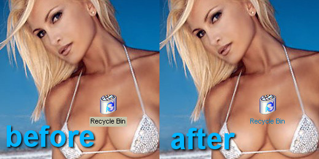



## Transparent Desktop Icon Background \*UPDATE\*

### Description

An update to my award winning code (thanks ppl :) Added a couple of features some ppl asked me for...like the ability to change the text colour of the icon and also keep the background transparent after a desktop refresh. I've made it into a mini application which can be run from the startup folder. Includes the complete source code and a compiled EXE for those who don't wanna bother with it. Read the HowTo.txt in the zip for all other info. If you like the code check out my site, http://www.em.f2s.com

Hope you learn something :)
 
### More Info
 

             |
---                |---
**Submitted On**   |2000-09-05 20:31:28
**By**             |[em ](https://github.com/Planet-Source-Code/PSCIndex/blob/master/ByAuthor/em.md)
**Level**          |Advanced
**User Rating**    |4.5 (36 globes from 8 users)
**Compatibility**  |VB 5\.0, VB 6\.0
**Category**       |[Complete Applications](https://github.com/Planet-Source-Code/PSCIndex/blob/master/ByCategory/complete-applications__1-27.md)
**World**          |[Visual Basic](https://github.com/Planet-Source-Code/PSCIndex/blob/master/ByWorld/visual-basic.md)
**Archive File**   |[CODE\_UPLOAD9639952000\.zip](https://github.com/Planet-Source-Code/em-transparent-desktop-icon-background-update__1-11272/archive/master.zip)

